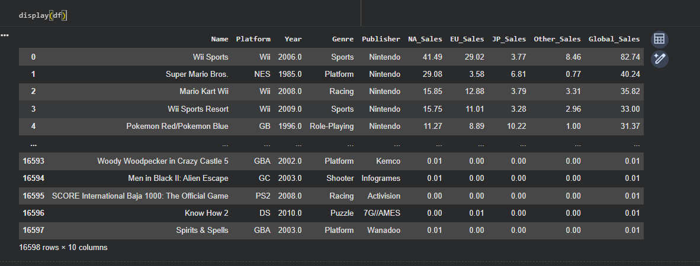
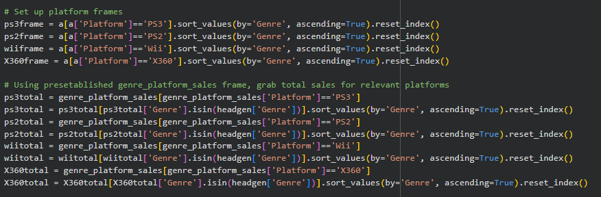
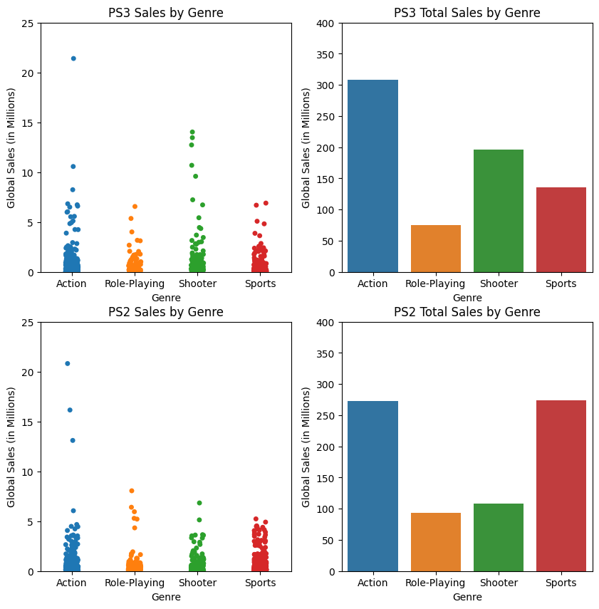
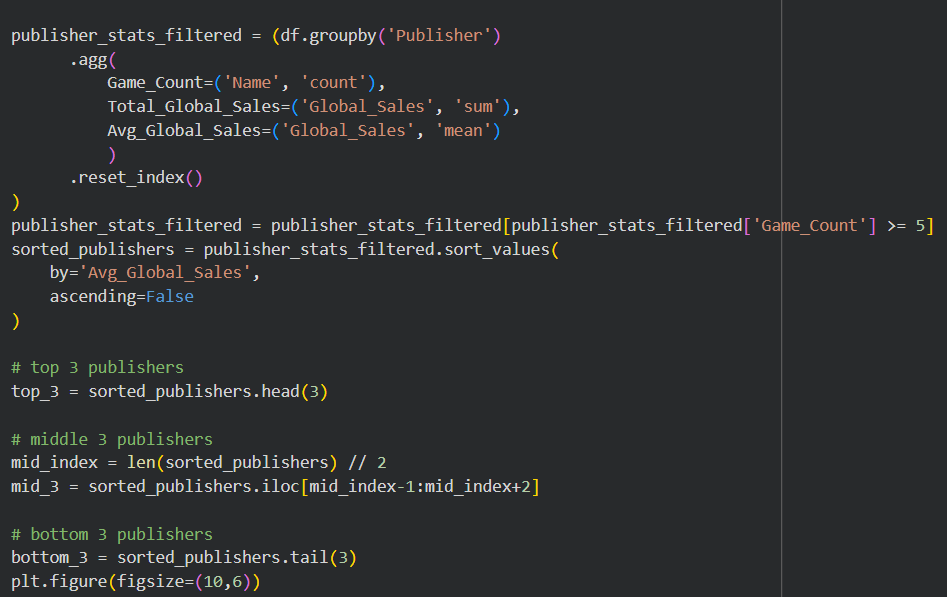
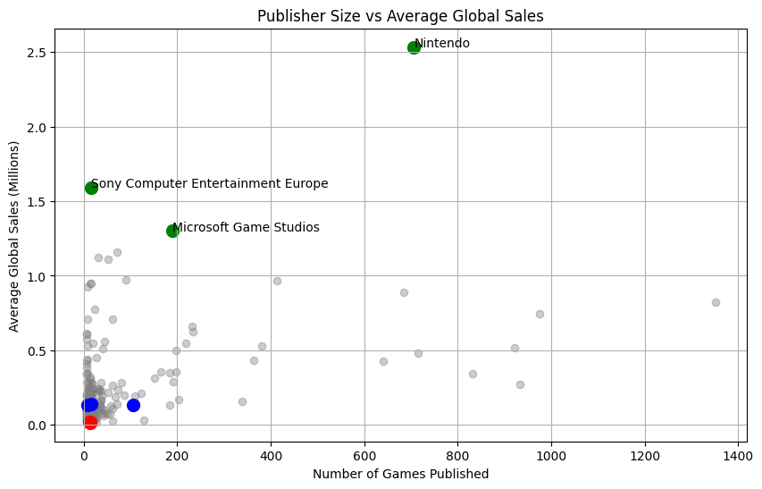
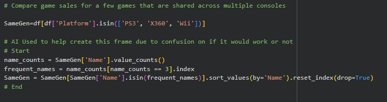
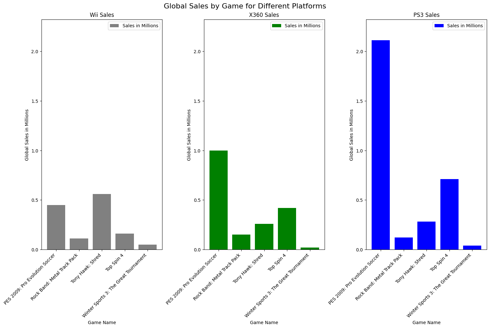
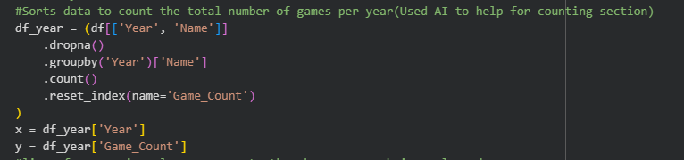
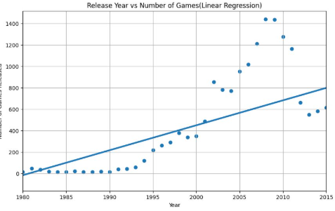

# Final Project for Data Science Fundamentals - Sean, Jake D, and Charles

## Introduction

The purpose of this project was to give us expereince with finding, cleaning, querying, and analyzing a dataset to build upon the skills we have learned throughout the semseter. We were tasked with locating a dataset, creating and answering five research questions, applying a machine learning technique, and creating this documentation. After some deliberation amongst our group we settled on a dataset of video game sales from Kaggle. Following our decision be began to create our guiding questions and settled on these 5:
* Is there any correlation between best preforming genere and platform?
* How do the top sales of NA, JP, EU, and other differ from each other?
* How does the average game sales change year over year?
* Does having a well known publisher correlate to having good sales?
* Does platform affect the sales of a game?

As for applying a machine learning technique, we settled on investigating:
* Does a games release year predict its global sales?
  

## Selection of Data

### Dataset Overview

We chose our [dataset](https://www.kaggle.com/datasets/gregorut/videogamesales) both because of interest and due to the fact that the large amount of numerical data contained within would allow us to analyze our data without too much transformation. Our dataset has several categories:

* The Ranking/Index
* The name of the game at said place
* The platform the particular game was released on
* The year of release
* The game's publisher
* The sales for North America (in millions)
* The sales for Europe (in millions)
* The sales for Japan (in millions)
* The sales for all other countries (in millions)
* The global/total sales overall (in millions)

### Dataset Cleaning

While our data was relatively clean, we still had about 2% (roughly 350 datapoints) of missing or N/A data. While much of this data was well enough down in the ranking to not have much of an effect on our final outcome, we opted to fill in a large chunk of this missing data by hand. The missing data was contained almost entirely in release year and/or publisher which are can be easily fact checked and filled in. By this effort did we bring the about 350 missing values down to 139 values, which is under 1% of our data. After bringing it to this point, we decided that our data was good enough to properly work with and went on to setting it up for analysis of our topic questions.

### Data Oddities

Our dataset does have a few oddities in it which we cant really fix or edit. The biggest oddity is that our data is missing sources from particular years, specificly 1979, 2018, and 2019. Some years also have very low numbers of logged releases which will likely affect our conclusions, likely not signifigantly but at least notably.

## Methods

### Packages

* Pandas
* Numpy
* Matplotlib
* Seaborn
  

### Charting/Machine Learning Applied

* Bar Chart
* Line Plot
* Scatter Plot
* Strip Plot
* Linear Regression
  

### Specific Analysis Features

To make work on our dataset easier, we decided to break up our original dataset into several subframes in our initialization. While most of these subframes were not utilized, they were a great initial foray into our data. By setting these up, we were able to further understand what information our data contained, see several different ways to set up later frames, and have shorthands for particular data groups to look at when asking questions.

## Results

Here is what we discovered after working with our dataset for a while.

### Question 1 (Is there any correlation between best preforming genere and platform?):

To properly see if there is correlation between top genre and top platform preformance, we first need to properly visualize genre preformance across our top platforms. To do this we first created a handful of frames to properly visualize the top four of each category.

The first set of frames (titled ___frame) show every game in the top four genres on the top four platforms. The second set (titled ___total) show the total sales of each of the top four genres across the top four platforms. Following the creation of these frames, we created two 2x2 figures to show both the individual sales and the total sales to see what relationships we could form. We decided to split these frames into two figures rather than one 4x2 figure to keep a reasonable sizing across each chart.

By looking over the data presented in our charts, we were able to come to one main conclusion. The first of which is there is a clear correlation between genre and platform preformance. Genre preformance across platform varries heavily, sometimes preforming signifigantly better on particular platforms over others. There can be many reasons for this, such as unique experiences for particular types of games on certain platforms or certain platforms advertizing themselves primarially on a particular genre, but our data does not have any clear information on these factors to find a clear answer.

### Question 2 (How do top sales differ by region?):

To see how the top games sold in each region, we set up a dataframe with each of the region's sales data, and name, for the top five selling games globally. 

The dataframe was used to create a bar graph with each game along the x-axis and each region's sales data(in millions of dollars) for that game along the y-axis. The graph was limited to the top five best selling games for visual clarity.

When we look at the data presented, we came to the conclusion that North America and the European Union were the driving factor in determining a game's global sales. This is not surprising as they are the two wealthiest continents and the only other measured catagory is Japan, which has a fraction of the population. It is important to note that this data set is only for console games and was published in 2017, as new games and other platforms, such as mobile and PC, would likely have different results.

### Question 3 (How does the average game sales change year over year?):

To see how the average game sold over time, we modified the dataframe from the previous question, changing the name of the game for the year and removing the limit on how many games were displayed. 

To aggregate every game by it's release year, we used the groupby function to sum the sales of each game released that year. Then, we took the average of each year's total sales and plotted each region's average sales per year.

When we look at the data, we notice that games had a very high average sale count in the mid 1980's and early 1990's(with a previous spike in the late 1970's for the North American audience specifically) with no year having an average sales of above half a million dollars. From this, we can conclude a few things. The first is that, intuitively, older games have had more time to make sales. The second is that the data set was published in 2017 and consoles such as the Xbox 1 and PS4 were not included(these consoles were released in 2013). New games are typically released on new platforms and the absence of these consoles from the dataset  skews the dataset toward older games. 

### Question 4 (Does having a large publisher size of released games correlate to having good sales?):

We asked this question to see whether game publishers make more money by releasing more games. We expected big publishers to have many games and high sales, and maybe some smaller companies making fewer games but lower profits than big developers. The code below shows that we grouped all publishers by total games released, sorted them, and plotted their sales.

After sorting, we decided to show the top 3, middle 3, and bottom 3 publishers in a scatter plot. Using 4 separate scatter plots, we combined them into a cohesive model.

Many of the data points there are expected, like the top 3 game publishers being companies with their own consoles and a lot of first-party games. The interesting part is that the middle 3 and the bottom 3 are very close together. Meaning there is a large gap in the data between the top 3 and the middle 3, and the best-selling publishers can also make hardware and publish many games. Smaller studios, though, can still have financial success with fewer releases and may have more losses if they create too many games.
### Question 5 (Does platform affect the sales of a game?):

Understanding how a game preforms across platforms is relatively simple in concept. We first need to decide exactly what platforms we are comparing. For the purposes of our analysis, we decided to look at the 7th console generation (The XBox 360, the Playstation 3, and the Nintendo Wii) and compare games shared across these consoles would be placed into a shared frame.

Then we generate a randomized list of names from this shared frame and produce shorthand frames per console containing only the information of these names.

After plotting this information, we can compare the sales of each game.
Example:

After making a few different generations of this chart, it has become abundantly clear that there is almost always some level of difference in preformance across platform. Considering that our data works in millions, every difference is usually in terms of thousands to hundreds of thousands of dollars. Notable differences tend to show up in every generation, showcasing that games tend to sell much better on particular platforms rather than noting similar sales across all platforms. This could be due to several factors ranging from audiances on particular platforms being attracted to certain aspects of a game to that particular platform offering a unique experience with a particular game. 

### Question 6 (Does a games release year predict its global sales?): 
We wondered if possibly the year of release could affect the sales of videogames. The early years might not have been appealing to certain audiences, such as the first videogame consoles being marketed as childrens toys. We expected that past the 90s and into the 2000s there would be more demand for videogames and and as more publishers released games the sales would always increase every year. 

The code here grouped data by year to count the number of released games per year and applied regression to show the trend​

What we can learn from this graph is that there is always an upward trend showing the high demand for videogames and the release year is a decent predictor for checking sales. Games may have been more easier at the start of the 2000s which shows the larger jump there, the line captures the growth of sales but it may not be consistent all the time.

## Conclusion

